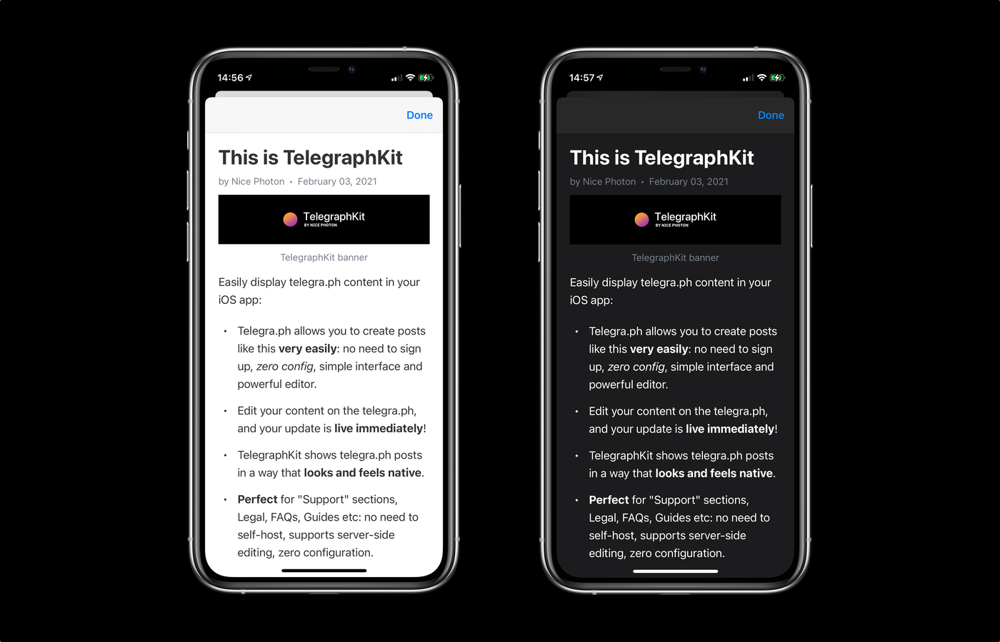
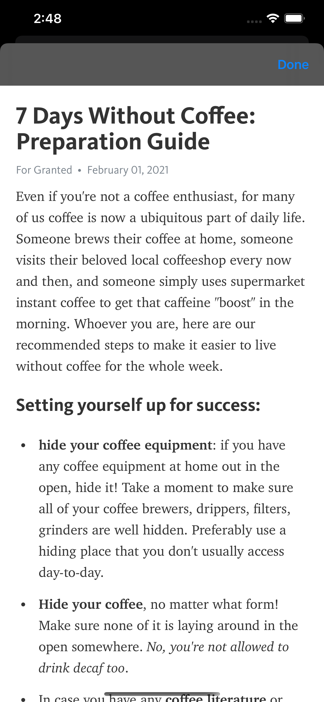
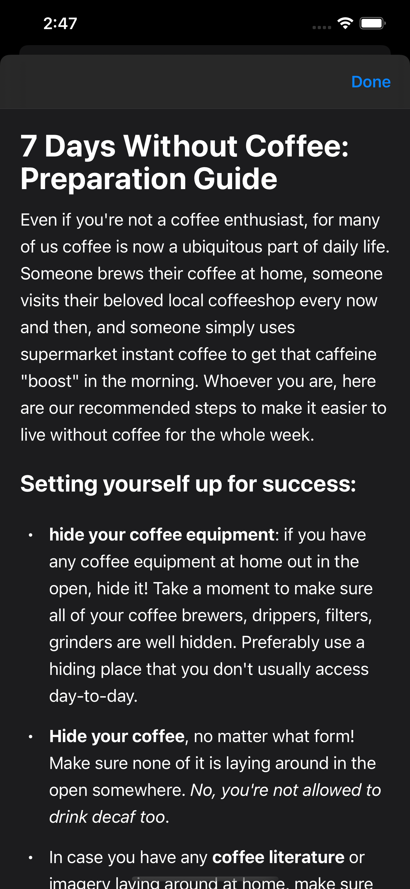

# TelegraphKit


**TelegraphKit** allows you to show web-content from [telegra.ph](https://telegra.ph) in a way that looks & feels native on an iOS device.



*"Wait, what on Earth is telegra.ph?"*

**Telegraph** is "a publishing tool that lets you create richly formatted posts with photos and all sorts of embedded stuff". It's main advantage is that you can create posts in seconds, with no need for an account and no configuration. And then using **TelegraphKit** you can easily show these posts in your app.

Maintainer: [@dreymonde](https://github.com/dreymonde)

Huge thanks to [@danielpunkass](https://github.com/danielpunkass) for his post ["Supporting Dark Mode: In-App Web Content"](https://indiestack.com/2018/10/supporting-dark-mode-in-app-web-content/), it helped us tremendously!

## Usage

1. Create a post on [telegra.ph](https://telegra.ph). There is no need to create an account or configure anything. Tap "PUBLISH" and copy the link.

2. Add **TelegraphKit** to your project (see "Installation" section below)

3. Somewhere in your project:

```swift
import TelegraphKit

let url = URL(string: "<your-telegraph-url>")!
let telegraphVC = TelegraphViewController(url: url)
let nvc = UINavigationController(rootViewController: telegraphVC)
self.present(nvc, animated: true)
```

## Guide

**TelegraphKit** is built on top of **WKWebView** that adds a few extra features specifically for telegra.ph articles:

- Dark Mode support (Telegraph web-version only supports light mode)
- Native fonts: **TelegraphKit** substitutes Telegra.ph fonts for Apple system ones in order to achieve that "native look and feel" (this can be configured)
- Customization: select between system and telegra.ph font styles, hide the author & date section, disable text selection & more.
- Layout improvements: **TelegraphKit** makes slight adjustments to the layout of the page to make it look best inside iOS apps

| Default telegra.ph look | **TelegraphKit version** |
| --- | --- |
|  |  |

### Creating TelegraphViewController

```swift
let telegraphVC = TelegraphViewController(url: URL(string: "https://telegra.ph/This-is-TelegraphKit-02-03")!)
// or
let telegraphVC = TelegraphViewController(postID: "This-is-TelegraphKit-02-03")
```

### Customizing the appearance

You can configure the appearance of your `TelegraphViewController` by using `TelegraphViewController.Appearance` struct:

```swift
let telegraphVC = TelegraphViewController(postID: "<your-post-id>", appearance: .appleSystem)
```

**TelegraphKit** provides you with two presets:

```swift
TelegraphViewController.Appearance
--->.appleSystem // (default)
--->.telegraph

--->.defaultAppearance // (equals .appleSystem by default)
```

You can fine-tune the appearance by creating it directly:

```swift
TelegraphViewController.Appearance(
    fontStyle: TelegraphViewController.Appearance.FontStyle, // .appleSystem or .telegraph
    hideAuthor: Bool,
    darkModeSupport: Bool, // true by default
    disableImageInteraction: Bool, // true by default
    disableSelection: Bool // false by default
)
```

To change the default appearance globally, you can modify `TelegraphViewController.Appearance.defaultAppearance`:

```swift
// Somewhere in AppDelegate.swift or similar:
TelegraphViewController.Appearance.defaultAppearance = .telegraph
```

## Installation

### Swift Package Manager
1. Click File &rarr; Swift Packages &rarr; Add Package Dependency.
2. Enter `http://github.com/nicephoton/TelegraphKit.git`.
